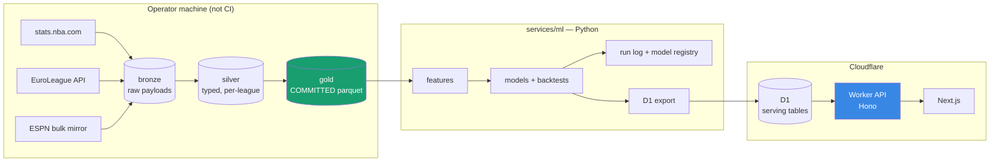

# HoopsLab

Estimating how basketball production translates between the EuroLeague and the
NBA — with the sample size, the selection bias, and the width of the error bars
stated up front.

[](https://github.com/darthmanwe/Hoops_Lab/actions/workflows/ci.yml)
[](LICENSE)

---

> ## Status: rebuilding (phase 2 of 8)
>
> **The data layer is real and committed. No model is fitted yet, so the API
> still serves no analytics.**
>
> An audit of the previous version found that every number it displayed came
> from a Python literal. The ETL was 723 lines of hardcoded dictionaries for
> four players and two games; the two API clients that would have fetched real
> data were never imported by anything; there were no models, no tests, and no
> data files. The web app presented those constants as model output.
>
> Phase 0 removed all of it. Phase 1 replaced it with **22,297 real
> player-seasons across three leagues**, a person-centric identity crosswalk,
> and 14 integrity checks that run offline on every push. Every analytics
> endpoint still returns `501` (coming back, with the phase that unblocks it)
> or `410` (permanently withdrawn, with the reason the metric cannot exist),
> because the models that will back them are phase 2.
>
> Progress is tracked in the [roadmap](#roadmap).

---

## Why this project exists

A EuroLeague guard averages 16 points on 58% true shooting with a 28% usage
rate. What should you expect if he signs in the NBA?

The folk answer is "multiply by about 0.75". The honest answer is that the
question is only answerable **conditional on the transfer having happened at
all** — and that the players who make the jump are a heavily selected group,
sitting well above their league's average. Most public attempts at this either
ignore that or wave at it.

HoopsLab estimates the translation coefficients directly, in **both**
directions, and treats the selection problem as something to measure rather
than assume away. It is a small-sample inference problem, not a Kaggle
leaderboard, and it is built accordingly.

## What makes it a hard problem

| Difficulty                                                                                                   | Approach                                                                                                                                                                                                                                                                                                                                                                                                     |
| ------------------------------------------------------------------------------------------------------------ | ------------------------------------------------------------------------------------------------------------------------------------------------------------------------------------------------------------------------------------------------------------------------------------------------------------------------------------------------------------------------------------------------------------ |
| Only ~2–5 EuroLeague→NBA transitions a year clear a usable minutes threshold — roughly 40–80 pairs in total. | Model **four** directions (EuroLeague⇄NBA, G League⇄NBA). The G League adds hundreds of pairs that stabilise the shared structure so the EuroLeague pairs can borrow strength instead of carrying the fit alone.                                                                                                                                                                                             |
| Players who cross leagues are selected on being good enough to be signed.                                    | Fit direction-specific intercepts with a shared slope. EuroLeague→NBA is selected _positively_, NBA→EuroLeague _negatively_; agreement between the two slopes is evidence the effect is not selection-driven, and disagreement quantifies how much of it is. Also shipped: a Heckman correction reported alongside the uncorrected estimate, and a plot of the transferring cohort against its whole league. |
| Aging and regression to the mean look like league effects.                                                   | Two-stage fit. Player-season dynamics are estimated from ~14,000 _same-league_ consecutive pairs; only the league offset depends on the small sample.                                                                                                                                                                                                                                                        |
| A cross-league player is not one entity in any public dataset.                                               | A person-centric identity model with an auditable crosswalk across four id systems, recording how each link was made and how confident it is.                                                                                                                                                                                                                                                                |

Details and the exact estimand are in [docs/modeling.md](docs/modeling.md).

## The data, as actually ingested

Committed to this repository as parquet, so a clean clone reproduces all of it
with no network access.

| Table               | Rows   | What it is                                                 |
| ------------------- | ------ | ---------------------------------------------------------- |
| `player_seasons`    | 22,297 | NBA 2000-24, EuroLeague 2007-24, G League 2015-24          |
| `persons`           | 5,349  | Human beings, 1,343 of whom appear in more than one league |
| `player_identities` | 6,913  | Source id → person, with match method and confidence       |
| `team_seasons`      | 1,433  | Team totals, the denominator of every usage rate           |
| `transition_pairs`  | 537    | Observed league switches                                   |

**The transition cohort — the sample the flagship model depends on:**

| Direction             | Pairs  | Players | Span      |
| --------------------- | ------ | ------- | --------- |
| NBA → G League        | 159    | 132     | 2013-2023 |
| NBA → EuroLeague      | 149    | 110     | 2005-2023 |
| **EuroLeague → NBA**  | **96** | **61**  | 2007-2023 |
| G League → NBA        | 59     | 45      | 2015-2023 |
| G League → EuroLeague | 59     | 45      | 2015-2023 |
| EuroLeague → G League | 15     | 14      | 2013-2023 |

The floor was set **before** the data was pulled: below 40 usable
EuroLeague→NBA pairs, the commitment was to report coefficients with intervals
only and refuse per-player point predictions. At 96 that is not triggered, and
the test asserting it is in the suite either way.

Spot-checking the cohort against reality: Micic, Vezenkov, Campazzo,
Fontecchio, Exum, Melli, Guduric, Landale and Bolden all appear with the
correct source and target seasons.

### Two bugs the validation caught

Both are the kind that survive an eyeball check, which is the argument for
having the checks at all.

**Usage rate was five times too large in two of three leagues.**
`stats.nba.com` reports team `MIN` as game-clock minutes (~3,966 per season);
summing player minutes gives ~19,830. The standard usage formula's `TmMP / 5`
term expects the latter. Using each source's own team totals meant the NBA was
right and the EuroLeague was wrong by exactly 5× — correlating at 0.998 with
the truth, and landing directly inside the coefficient the project exists to
estimate. Now every team total is derived from the same player rows that supply
the numerator, and a check compares the result against the league's own
published values on every build:

```
[PASS] rate_agreement:usg_pct   MAD 0.00590 against tolerance 0.010 over n=9,783
[PASS] rate_agreement:ts_pct    MAD 0.00025 against tolerance 0.001 over n=9,783
[PASS] rate_agreement:ast_pct   MAD 0.00576 against tolerance 0.010 over n=9,783
```

The residual is explained and bounded: the league computes usage per team
stint, so a player traded mid-season is measured against each team separately.

**1,321 identities pointed at people who did not exist.** `persons` was built
from names rather than from identities, so any player without a name — G League
rows arrive with a few — was dropped while the row referencing them survived.
`persons` is now derived from `identities`, making the two unable to disagree.

## Architecture



Two decisions shape everything else:

**The Worker does no arithmetic.** Cloudflare Workers get 10 ms of CPU per
request on the free tier. The previous version computed player similarity by
loading a whole season table into Worker memory and sorting it in JavaScript —
survivable against four hardcoded players, impossible against six hundred real
ones. Every served number is now a column computed in Python. This removes the
CPU problem and eliminates train/serve skew by construction.

**Gold data is committed to the repository.** Raw event data (~3M shot records)
would exceed D1's 500 MB free-tier database limit on its own, and would take a
month to load at 100k row-writes per day, so it lives in parquet. The
analysis-ready tables — around 30 MB — are committed, which means **a clean
clone reproduces every reported number with no network access whatsoever.**
`hoopslab verify` re-derives each table's checksum against its committed
contract, so silent data drift fails the build.

## Repository layout

```
apps/api/          Hono on Cloudflare Workers — serves precomputed columns
apps/web/          Next.js — player, comparison and calibration views
services/ml/       Python package `hoopslab` — ingest, features, models, eval
data/gold/         Committed parquet + contract sidecars (phase 1)
data/bronze,silver Gitignored, regenerable
docs/              Modelling notes, errors, deployment, development
```

## Quickstart

```bash
git clone https://github.com/darthmanwe/Hoops_Lab.git
cd Hoops_Lab

npm ci
npm run test              # 75 Worker tests, inside workerd, real D1 + KV bindings

cd services/ml
uv sync --extra dev
uv run pytest             # 135 tests, offline, no credentials
uv run hoopslab verify    # re-derives every checksum against the committed data
```

No API keys. No network after the clone. See
[docs/development.md](docs/development.md) for the full task list and the
Windows-specific notes.

Try the API:

```bash
npm run dev
curl http://127.0.0.1:8787/            # every endpoint and its current state
curl http://127.0.0.1:8787/health      # actually probes D1 and KV
curl http://127.0.0.1:8787/leaderboards/gravity   # 410, and explains why
```

## Roadmap

| Phase | Deliverable                                                                                                                     | State   |
| ----- | ------------------------------------------------------------------------------------------------------------------------------- | ------- |
| **0** | Remove fabricated data; workspace, tooling, CI, honest API surface                                                              | ✅ done |
| **1** | Real ingestion (NBA 2000-25, EuroLeague 2007-25, G League 2015-25), identity crosswalk, data contracts, committed gold          | next    |
| **2** | **Translation model** — two-stage hierarchical fit, four baselines, cluster-bootstrap intervals, selection analysis, model card |         |
| **3** | Serving contract — Drizzle schema, real migrations, typed routes, OpenAPI, provenance envelope                                  |         |
| **4** | Shot data, archetypes (CLR → GMM with published per-cluster stability), empirical-Bayes shooting, game calibration              |         |
| **5** | Frontend — TypeScript, court shot charts, calibration page, translation explorer, accessibility                                 |         |
| **6** | Grounded Claude scouting reports with a groundedness harness and a $0 cached demo                                               |         |
| **7** | Presentation — measured results, architecture, model cards                                                                      |         |
| **8** | _Stretch:_ play-by-play, stint reconstruction, RAPM with standard errors                                                        |         |

Phases 1 and 2 are the critical path to something worth showing.

## What this is not

Filled in with measured numbers as each phase lands. What can be said already:

- **There is no gravity metric.** Gravity measures defensive attention, which
  requires optical player-tracking data. The NBA does not publish it and the
  EuroLeague does not collect it. The previous version of this project reported
  gravity values that were typed by hand. `/leaderboards/gravity` returns `410`
  and says so.
- **Lineup offensive rating will not be projected** until possession-level data
  is ingested. The previous version projected it from nine coefficients
  hardcoded in a route handler that nothing had fitted. The endpoint will
  return an explicit `null` with the reason attached.
- **The translation model estimates a conditional quantity.** It answers "given
  that this player got an NBA contract, what does history say to expect", not
  "what would a random EuroLeague player do". Only the first is identified from
  the data.
- **Per-player intervals will be wide.** Expected out-of-fold error on usage
  rate is around 3–5 percentage points against a population standard deviation
  of about 5. That is useful for ranking a cohort and useless for deciding a
  contract, and it will be reported as such.
- **The game model is not a betting model.** It is expected to lose to the
  closing line, and the gap will be published. There is no bankroll, no Kelly
  sizing and no ROI curve in this repository.
- **The EuroLeague match rate is 25.5%**, and that is the correct order of
  magnitude rather than a shortfall: most EuroLeague players never play in the
  NBA. What matters is that unmatched and ambiguously-matched players are
  recorded as such and excluded from the modelling cohort, rather than guessed.
- **Nothing here is causal.**

## Engineering notes

Things that are load-bearing rather than decorative:

- **Tests run inside workerd**, not against a mock, with real D1 and KV
  bindings — so SQLite semantics and runtime limits are exercised for real.
  `remoteBindings` is explicitly disabled; it defaults to `true` in
  pool-workers 0.21, which would let the suite reach live Cloudflare resources.
- **Python tests cannot spend money.** Billed and networked tests are
  marker-gated and deselected by default, `conftest.py` clears the credential
  environment _and_ disables `.env` loading (`pydantic-settings` reads the file
  in addition to the environment, so clearing one is not enough), and CI sets
  an empty key at the workflow level.
- **CI runs on Windows and Linux**, across Node 22/24 and Python 3.11–3.13,
  because the project is developed on Windows and path handling is the most
  likely thing to work locally and break in the matrix.
- **`npm ci`, never `npm install`.** The previous pipeline used `npm install`
  while six dependencies were pinned to `"latest"`, so the lockfile was
  advisory and a build could break overnight with no code change.
- **No bindings at the top level of `wrangler.toml`.** Previously the
  production D1 id sat there, so `wrangler dev` and `wrangler deploy` both
  pointed at production. A bare `wrangler deploy` now fails loudly.
- **A CI job asserts no endpoint serves data**, and that the fabricated ETL has
  not come back. The phase 0 guarantee is enforced, not promised.
- **Ingestion is resumable and free to re-run.** Every fetch is content-addressed
  and recorded in an append-only manifest, so an interrupted pull loses only the
  request in flight, and rebuilding gold touches no source at all.
- **`stats.nba.com` ingestion cannot run in CI** — it refuses datacenter IP
  ranges, and Actions runners are on Azure. That is why gold is committed and
  why the nightly cron was deleted rather than repaired.

## Licence

MIT. See [LICENSE](LICENSE).

Data comes from public NBA, EuroLeague and G League sources and is used for
non-commercial analysis. The EuroLeague client is GPLv3, so it is kept as an
optional `ingest` extra and never a runtime dependency — the repository ships
derived data, which is not a derivative work of that code.
