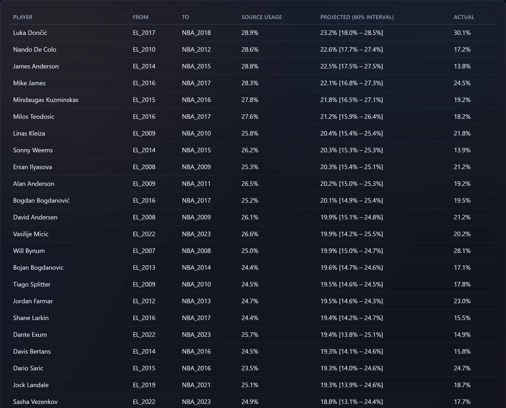
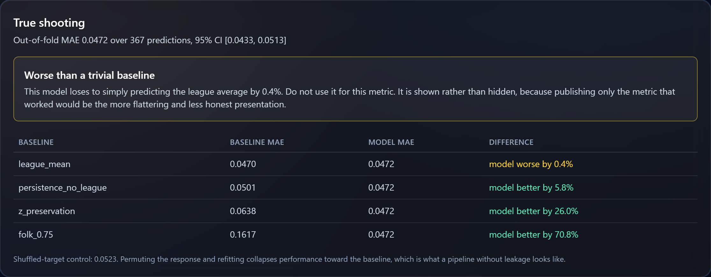
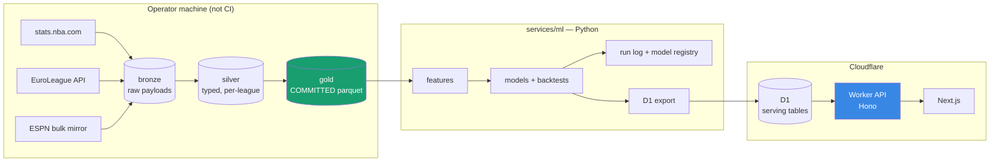
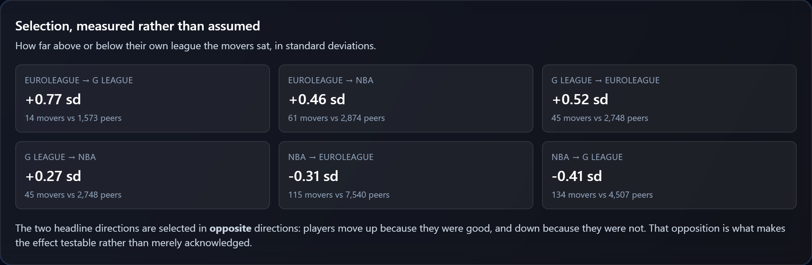
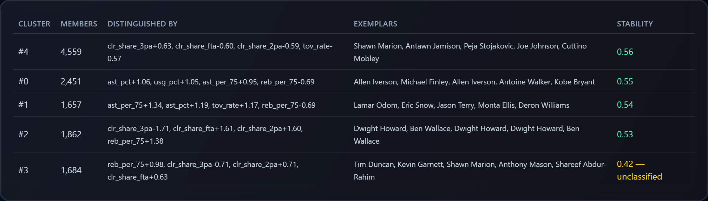
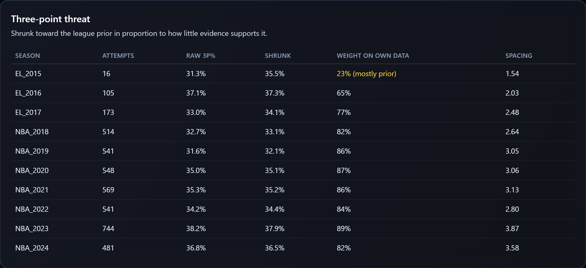
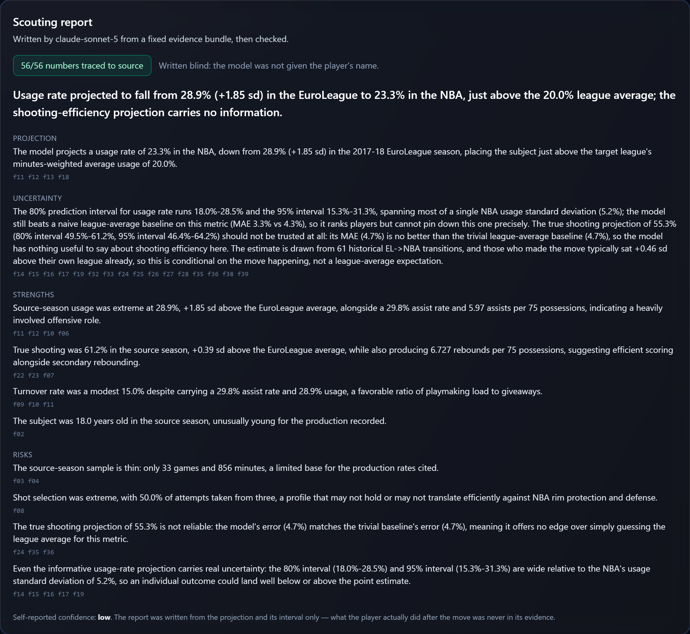
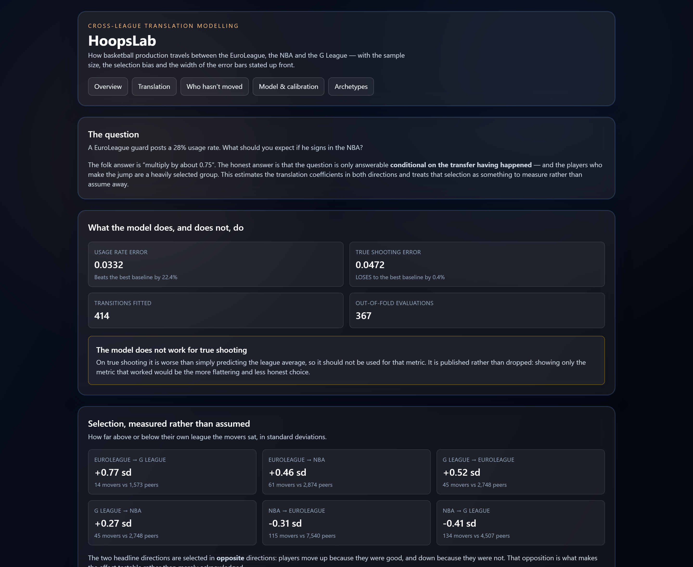

# HoopsLab

**What happens to a basketball player's production when they change leagues?**

An estimate of how production travels between the EuroLeague, the NBA and the
G League — built on 414 real transfers, with the sample size, the selection
bias and the width of the error bars stated on the front page rather than in a
footnote.

[](https://github.com/darthmanwe/Hoops_Lab/actions/workflows/ci.yml)
[](LICENSE)




_Every observed EuroLeague→NBA transfer since 2007. Source usage, the projected
NBA usage with an 80% interval, and — where the move has already happened —
what the player actually did. Dončić is the first row, and the model gets him
wrong._

---

## The short version

A EuroLeague guard posts a 28% usage rate. He signs in the NBA. What should you
expect?

The folk answer is "multiply by about 0.75". That rule is **worse than ignoring
the player entirely** — it loses to simply predicting the league average, and
this repository measures by how much.

The honest answer is harder, and it is the reason this is an inference problem
rather than a prediction contest:

1. **Only ~61 EuroLeague→NBA transfers** in eighteen seasons clear a usable
   minutes threshold. That is the entire sample.
2. **The players who move are not a random sample.** They are the ones good
   enough to be offered a contract, and they sit **+0.46 standard deviations**
   above their own league. Any estimate is conditional on the transfer having
   happened.
3. **Aging and mean reversion look exactly like league effects** unless you
   separate them, which needs far more data than 61 pairs.

HoopsLab handles all three, publishes what it gets wrong, and ships an
interface where every number on screen carries the model version and data
snapshot that produced it.

|                     |                                                                                   |
| ------------------- | --------------------------------------------------------------------------------- |
| **Usage rate**      | out-of-fold MAE **0.0332** — beats the best trivial baseline by **22.4%**         |
| **True shooting**   | out-of-fold MAE **0.0471** — **loses** to the league average by 0.3%, and says so |
| **Sample**          | 414 transfers, 22,297 player-seasons, three leagues, 2000–2025                    |
| **Reproducibility** | every number refits from committed data with **no network**, on every push        |

### What it gets wrong, on the front page

Luka Dončić is the most visible transfer in the dataset, and the model misses
him:

| Metric        | EuroLeague 2017-18 | Projected (80% interval) | Actual NBA 2018-19             |
| ------------- | ------------------ | ------------------------ | ------------------------------ |
| Usage rate    | 28.9%              | 23.3% [18.0% – 28.5%]    | **30.1%** — above the interval |
| True shooting | 61.2%              | 55.3% [49.5% – 61.2%]    | 54.5% — inside it              |

He used _more_ possessions as a rookie than he had in Europe, which is the
opposite of the compression the model estimates on average. That row is first
in the table above, not buried in an appendix, because a projection tool that
hides its misses is not a projection tool.

## For a front office

The output is a **ranking instrument, not a pricing instrument**, and the
interface says which:

- An 80% interval on projected usage spans roughly **two standard deviations of
  the receiving league**. That is genuinely useful for sorting a shortlist of
  targets and genuinely useless for setting a number on a contract. The
  interval is presented as the result, not as a caveat attached to one.
- **True shooting is not projectable** by this method — shooting efficiency is
  mostly year-to-year noise (stage-1 R² of 0.30 against 0.74 for usage). The
  API returns `beats_best_baseline: false` for that metric so a consumer learns
  it from the data.
- **Every historical comparable is one click away**, with what the model said
  and what actually happened side by side. The claim and the check are never on
  separate pages.



_The model's own report card. It leads with the metric it fails at._

## How it is built

| Layer      | Stack                                                   | The constraint that shaped it                                                                                                                                                    |
| ---------- | ------------------------------------------------------- | -------------------------------------------------------------------------------------------------------------------------------------------------------------------------------- |
| Modelling  | Python 3.12, polars, statsmodels, scikit-learn, pandera | 61 transfers in the flagship direction — a small-sample inference problem, so OLS with a cluster bootstrap over players rather than gradient boosting with no usable uncertainty |
| Serving    | Cloudflare Workers, Hono, D1, Drizzle                   | 10 ms of CPU per request, so the Worker does **no arithmetic** — every served number is a column computed offline, which also removes train/serve skew by construction           |
| Interface  | Next.js 16, TypeScript                                  | The previous version rendered missing data as `0.00`; the rewrite has no path that coerces a null to a number                                                                    |
| LLM layer  | Anthropic SDK, Pydantic structured outputs              | Groundedness has to be checkable, so retrieval is a fixed `SELECT` and citations are enforced by the schema rather than requested in a prompt                                    |
| Evaluation | pytest, hypothesis, vitest inside workerd               | Leakage assertions run **inside** the CV loop at runtime, not in a test that could pass while the splitter changed                                                               |

333 tests, all offline and credential-free. CI runs Ubuntu and Windows across
Node 22/24 and Python 3.11–3.13, and refits every model on each push to prove
the numbers here still hold.

## Why this project exists

A EuroLeague guard averages 16 points on 58% true shooting with a 28% usage
rate. What should you expect if he signs in the NBA?

The folk answer is "multiply by about 0.75". The honest answer is that the
question is only answerable **conditional on the transfer having happened at
all** — and that the players who make the jump are a heavily selected group,
sitting well above their league's average. Most public attempts at this either
ignore that or wave at it.

HoopsLab estimates the translation coefficients directly, in **both**
directions, and treats the selection problem as something to measure rather
than assume away. It is a small-sample inference problem, not a Kaggle
leaderboard, and it is built accordingly.

## What makes it a hard problem

| Difficulty                                                                                                   | Approach                                                                                                                                                                                                                                                                                                                                                                                                     |
| ------------------------------------------------------------------------------------------------------------ | ------------------------------------------------------------------------------------------------------------------------------------------------------------------------------------------------------------------------------------------------------------------------------------------------------------------------------------------------------------------------------------------------------------ |
| Only ~2–5 EuroLeague→NBA transitions a year clear a usable minutes threshold — roughly 40–80 pairs in total. | Model **four** directions (EuroLeague⇄NBA, G League⇄NBA). The G League adds hundreds of pairs that stabilise the shared structure so the EuroLeague pairs can borrow strength instead of carrying the fit alone.                                                                                                                                                                                             |
| Players who cross leagues are selected on being good enough to be signed.                                    | Fit direction-specific intercepts with a shared slope. EuroLeague→NBA is selected _positively_, NBA→EuroLeague _negatively_; agreement between the two slopes is evidence the effect is not selection-driven, and disagreement quantifies how much of it is. Also shipped: a Heckman correction reported alongside the uncorrected estimate, and a plot of the transferring cohort against its whole league. |
| Aging and regression to the mean look like league effects.                                                   | Two-stage fit. Player-season dynamics are estimated from 7,680 _same-league_ consecutive pairs; only the league offset depends on the small sample.                                                                                                                                                                                                                                                          |
| A cross-league player is not one entity in any public dataset.                                               | A person-centric identity model with an auditable crosswalk across four id systems, recording how each link was made and how confident it is.                                                                                                                                                                                                                                                                |

Details and the exact estimand are in [docs/modeling.md](docs/modeling.md).

## The data, as actually ingested

Committed to this repository as parquet, so a clean clone reproduces all of it
with no network access.

| Table               | Rows   | What it is                                                 |
| ------------------- | ------ | ---------------------------------------------------------- |
| `player_seasons`    | 22,297 | NBA 2000-24, EuroLeague 2007-24, G League 2015-24          |
| `persons`           | 5,347  | Human beings, 1,343 of whom appear in more than one league |
| `player_identities` | 6,913  | Source id → person, with match method and confidence       |
| `team_seasons`      | 1,433  | Team totals, the denominator of every usage rate           |
| `transition_pairs`  | 414    | Observed league switches, all of which enter the fit       |

**The transition cohort — the sample the flagship model depends on:**

| Direction             | Pairs  | Players | Span      |
| --------------------- | ------ | ------- | --------- |
| NBA → G League        | 134    | 132     | 2013-2023 |
| NBA → EuroLeague      | 115    | 110     | 2005-2023 |
| **EuroLeague → NBA**  | **61** | **61**  | 2007-2023 |
| G League → NBA        | 45     | 45      | 2015-2023 |
| G League → EuroLeague | 45     | 45      | 2015-2023 |
| EuroLeague → G League | 14     | 14      | 2013-2023 |

Candidates are reduced to a **matching**: within a person and direction, each
source season and each target season is used at most once. An earlier version
deduplicated only on the target and reported 96 EuroLeague→NBA pairs, which
double-counted departures; the correct figure is 61. The serving primary key is
what surfaced it.

The floor was set **before** the data was pulled: below 40 usable
EuroLeague→NBA pairs, the commitment was to report coefficients with intervals
only and refuse per-player point predictions. At 61 that is not triggered, and
the test asserting it is in the suite either way.

Spot-checking the cohort against reality: Micic, Vezenkov, Campazzo,
Fontecchio, Exum, Melli, Guduric, Landale and Bolden all appear with the
correct source and target seasons.

### Two bugs the validation caught

Both are the kind that survive an eyeball check, which is the argument for
having the checks at all.

**Usage rate was five times too large in two of three leagues.**
`stats.nba.com` reports team `MIN` as game-clock minutes (~3,966 per season);
summing player minutes gives ~19,830. The standard usage formula's `TmMP / 5`
term expects the latter. Using each source's own team totals meant the NBA was
right and the EuroLeague was wrong by exactly 5× — correlating at 0.998 with
the truth, and landing directly inside the coefficient the project exists to
estimate. Now every team total is derived from the same player rows that supply
the numerator, and a check compares the result against the league's own
published values on every build:

```
[PASS] rate_agreement:usg_pct   MAD 0.00590 against tolerance 0.010 over n=9,783
[PASS] rate_agreement:ts_pct    MAD 0.00025 against tolerance 0.001 over n=9,783
[PASS] rate_agreement:ast_pct   MAD 0.00576 against tolerance 0.010 over n=9,783
```

The residual is explained and bounded: the league computes usage per team
stint, so a player traded mid-season is measured against each team separately.

**1,321 identities pointed at people who did not exist.** `persons` was built
from names rather than from identities, so any player without a name — G League
rows arrive with a few — was dropped while the row referencing them survived.
`persons` is now derived from `identities`, making the two unable to disagree.

## Architecture



Two decisions shape everything else:

**The Worker does no arithmetic.** Cloudflare Workers get 10 ms of CPU per
request on the free tier. The previous version computed player similarity by
loading a whole season table into Worker memory and sorting it in JavaScript —
survivable against four hardcoded players, impossible against six hundred real
ones. Every served number is now a column computed in Python. This removes the
CPU problem and eliminates train/serve skew by construction.

**Gold data is committed to the repository.** Raw event data (~3M shot records)
would exceed D1's 500 MB free-tier database limit on its own, and would take a
month to load at 100k row-writes per day, so it lives in parquet. The
analysis-ready tables — around 30 MB — are committed, which means **a clean
clone reproduces every reported number with no network access whatsoever.**
`hoopslab verify` re-derives each table's checksum against its committed
contract, so silent data drift fails the build.

## Results

Out-of-fold, leave-one-target-season-out **grouped by player**, n = 367.
Reproduced by CI on every push.

| Metric          | MAE        | 95% CI (cluster bootstrap) | Best baseline        | Verdict                      |
| --------------- | ---------- | -------------------------- | -------------------- | ---------------------------- |
| Usage rate      | **0.0332** | [0.0306, 0.0357]           | 0.0428 (league mean) | **beats it by 22.4%**        |
| True shooting % | 0.0471     | [0.0433, 0.0512]           | 0.0470 (league mean) | **loses by 0.3% — unusable** |

Against every baseline, on usage rate:

| Baseline                       | MAE    | Model better by |
| ------------------------------ | ------ | --------------- |
| League mean                    | 0.0428 | 22.4%           |
| Stage-1 persistence, no league | 0.0505 | 34.3%           |
| z-preservation                 | 0.0527 | 37.1%           |
| The folk ×0.75 rule            | 0.0749 | 55.7%           |

**Estimated compression: β = 0.724** for usage. A slope below one means
standing within a league compresses on the way across.

### The model does not work for true shooting, and says so

On true shooting it is **worse than predicting the league average**. Rather
than drop the metric that failed, the API serves the verdict:
`beats_best_baseline` comes back `false`, so a consumer learns it from the data
rather than from a footnote. Publishing only the metric that worked would have
been the more flattering and less honest presentation.

Three things in that table are worth more than the headline:

- **The folk ×0.75 rule is worse than predicting the league average** (0.0749
  vs 0.0428). The rule everyone quotes is not merely imprecise; it is beaten by
  ignoring the player entirely.
- **Stage-1 persistence alone is also worse than the league mean** (0.0505).
  Applying same-league year-to-year dynamics to a cross-league move actively
  misleads, which is the clearest evidence that the league term is doing real
  work rather than decorating a trend.
- **True shooting is not predictable by this model** — it loses to the league
  mean, with stage-1 R² of 0.30 against 0.74 for usage. Shooting efficiency is
  mostly noise year to year. It is reported because dropping the weaker of two
  headline metrics would be selective.

### What it looks like when the model is wrong

Luka Dončić, EuroLeague 2017-18 → NBA 2018-19, is the transition everyone
knows. The model gets one of the two metrics wrong:

| Metric        | Source | Predicted (80% interval) | Actual                         |
| ------------- | ------ | ------------------------ | ------------------------------ |
| Usage rate    | 28.9%  | 23.7% [18.5%, 28.8%]     | **30.1%** — above the interval |
| True shooting | 61.2%  | 55.2% [49.7%, 60.6%]     | 54.5% — inside it              |

He used more possessions as an NBA rookie than he had in the EuroLeague, which
is the opposite of the compression the model estimates on average. That is a
real miss on the most visible case in the dataset, and it is on the front page
rather than in a footnote.

### Selection, measured rather than assumed

The movers are not a random sample of the league they leave, and the whole
estimate is conditional on that. How far above their own peers they sat:

| Direction        | Movers | Gap vs peers, usage |
| ---------------- | ------ | ------------------- |
| EuroLeague → NBA | 61     | **+0.46 sd**        |
| NBA → EuroLeague | 115    | **−0.31 sd**        |
| G League → NBA   | 45     | +0.27 sd            |
| NBA → G League   | 134    | −0.41 sd            |

The two headline directions are selected in **opposite** directions, exactly as
the design predicted: players move up because they were good, and down because
they were not. That opposition is what makes the effect testable rather than
merely acknowledged.



**And the test does not pass.** Fitting a separate slope per direction gives
0.579 for EuroLeague→NBA and 0.982 for NBA→EuroLeague — a gap of 0.40.
If one slope fitted both, the compression would be unlikely to be a selection
artefact. It does not, so part of the estimated compression is
direction-specific. That is reported here, in the model card, and in the CLI
output, because burying it would be the single easiest way to make this project
look better than it is.

Full method, caveats and fairness notes:
[model card](services/ml/src/hoopslab/configs/model_cards/translation.md).

## Archetypes and shooting

Two descriptive models, added in phase 4, replacing the hand-written
`archetype_vector_json` and the fabricated `nba_gravity`.

**Archetypes.** Centred log-ratio on the compositional shot mix, within-season
standardisation, PCA, then a Gaussian mixture. `k = 5`, chosen where two
criteria disagreed: held-out log-likelihood keeps improving with `k` but
flattens after 5, while bootstrap stability collapses at `k ≥ 6` (mean Jaccard
0.52 → 0.40). The smaller `k` wins.

| Cluster | Distinguished by                            | Exemplars                    | Stability |
| ------- | ------------------------------------------- | ---------------------------- | --------- |
| 0       | high usage and assist rate                  | Iverson, Kobe Bryant         | 0.55      |
| 1       | very high assist rate and turnovers         | Eric Snow, Deron Williams    | 0.54      |
| 2       | no threes, heavy free throws, most rebounds | Dwight Howard, Ben Wallace   | 0.53      |
| 3       | rebounds, few threes                        | Duncan, Garnett              | **0.42**  |
| 4       | highest three-point share                   | Peja Stojaković, Joe Johnson | 0.56      |

**Mean stability is 0.52 — moderate, not a crisp taxonomy.** Cluster 3 falls
below the floor and is served with `reportable: false`, meaning read it as
_unclassified_ rather than as a type. That flag is in the API payload, not just
in this table.



_The interface refuses to name the cluster that does not survive resampling._

**Shooting, replacing "gravity".** Gravity measures defensive attention and
needs optical tracking data that no public source provides, so it is gone
rather than renamed. What is computable is threat, and the statistical problem
is small samples:

| Attempts | Raw 3P% | Shrunk | Weight on own data |
| -------- | ------- | ------ | ------------------ |
| 1        | 1.000   | 0.358  | 0.01               |
| 35       | 0.371   | 0.362  | 0.27               |
| 876      | 0.408   | 0.403  | 0.90               |

`shrinkage_weight` ships with every value, so a reader can see how much of a
number is the player and how much is the league prior.



_Dončić's three-point record. His 16-attempt EuroLeague season is flagged
`23% (mostly prior)` — the number shown is mostly the league, not the player,
and the interface says so instead of presenting 31.3% as a measurement._
[Model card](services/ml/src/hoopslab/configs/model_cards/roles.md).

## Grounded scouting reports

Claude writes a short brief on each league transition, and every number in it is
checked back to source. The interesting part is not the prose; it is that
"it did not make anything up" is **measured**, offline, at zero cost.

Three design choices carry that.

**Retrieval is a `SELECT`, not an agent.** The admissible fact set for a
player-season is fixed and knowable, so it is fetched whole and passed in one
turn. An agent would add latency, cost and nondeterminism, and would introduce
the exact failure being engineered out — _not_ retrieving something and filling
the gap from pretraining. An agent here would be a demo of agents, not a
solution to the problem.

**The name is withheld.** Told it is looking at a particular player, a model
writes a fluent, confident brief from memory, and every groundedness figure
measured that way is meaningless. In evaluation the subject is `Player A` and
the clubs are `Team X`; naming any of them is an automatic failure.

**The outcome is withheld too.** What the player actually did after the move is
never in the bundle. The brief is written from the projection and its interval
alone, and the outcome is shown beside it — the same separation this project
uses everywhere between what a model claims and how it did.



_A report on the Dončić transfer. The model was never told whose season it was.
Every claim carries the ids of the facts supporting it, and the badge is a
count, not a promise: 56 numeric tokens in the prose, 56 traced back to the
evidence bundle._

### Measured, on 30 anonymised reports

|                                   |                 |
| --------------------------------- | --------------- |
| Fully grounded                    | **30/30**       |
| Numeric tokens traced to evidence | **1,027/1,027** |
| Distractor detection              | **1.00**        |
| Cost to re-run                    | **$0.00**       |

The distractor line is the one to read first. A groundedness rate of 1.00 proves
nothing on its own — a checker that accepts everything scores 1.00 too — so
every report is re-scored against **a different player's evidence**, and all of
them are rejected. The checks are reading the evidence, not the prose.

Eight defects surfaced while building the checker, and **every one was a false
positive in the checker rather than a fabrication by the model**: a hyphen read
as a minus sign, so `per-75` invented the token `-75`; possessives and
hyphenated compounds read as unknown entities; a case-insensitive redaction list
that made the adjective "real" leak "Real Madrid"; a direction rule that fired
on prose describing the width of its own interval; and derived quantities the
bundle supports but does not state — interval width, the projected change —
treated as inventions. Each fix was verified against the distractor control,
which held at 1.00 throughout, so none of them bought a passing grade by
loosening the check.

### The judge, and a prediction that was wrong

This layer was built predicting that a deterministic regex would beat an LLM
judge at catching bad numbers. Against 30 labelled reports:

| Detector                        | κ          | Accuracy |
| ------------------------------- | ---------- | -------- |
| LLM judge (Opus grading Sonnet) | **+0.783** | 0.967    |
| Deterministic checker           | +0.000     | 0.900    |

The prediction was wrong, and the reason is worth more than the prediction. The
two answer different questions. The checker asks _is this number in the
evidence?_ — across 1,027 tokens the answer was always yes, so it has no
positives and κ = 0 is a definition, not a failure. The judge asks _is this
number used for what it measures?_, which the checker cannot express.

All three errors found were of the second kind:

- a usage standing of **−0.97 sd** described as "well above their own league's
  average", and then used to support a claim about selection;
- a projection of **15.5%** called "below the 15.0% a simple 0.75× rule would
  suggest";
- a player's own **64.7%** true shooting attached to "the NBA average".

The judge caught the first two and missed the third — the most debatable of
them. **Arithmetic settles provenance and cannot settle meaning:** a harness
reporting only the traceability figure reads 100% while the prose contains a
reversed sign. That is why both run, and why neither is reported without κ
beside it.

κ rather than accuracy because fabrication is rare — a detector answering "no"
to everything reaches 90% accuracy and detects nothing.

**Caveat, stated because it matters:** the labels are not human. They were
produced by a model reading each report against its bundle, and the judge is the
same model family, so this agreement runs higher than an independent human
reader would produce. Treat κ as an upper bound; the three flagged reports are
the durable finding. Records in
[`data/llm_labels/`](data/llm_labels/) and
[`services/ml/runs/judge/`](services/ml/runs/judge/).

### Costing $0 to re-run

~30 responses are content-addressed on `sha256(model + system + evidence + schema

- max_tokens)`and **committed**, so the demo and the entire evaluation run with
no key and no network. Spending requires`--refresh-cache`plus a`--max-calls`ceiling checked _before_ each request. Generating them cost **$1.19** at list
rates, with 54.5% of prompt tokens served from the API's prompt cache — a
measured figure from`usage.cache_read_input_tokens`, not a claim.

```bash
npm run demo:llm     # re-scores all 30 committed reports; $0, no key
```

A CI job runs exactly that on every push. It also catches a subtler failure than
a bad report: if a transform changes the data, the rebuilt evidence no longer
matches what the model was shown, every response is dropped as stale, and the
run has nothing to score — so prose quietly describing superseded numbers fails
the build instead of shipping.

## Repository layout

```
apps/api/          Hono on Cloudflare Workers — serves precomputed columns
apps/web/          Next.js — translation explorer, model card, player pages
services/ml/       Python package `hoopslab` — ingest, features, models, eval, llm
data/gold/         Committed parquet + contract sidecars
data/llm_cache/    Committed model responses, so the demo costs nothing
data/llm_labels/   Hand-graded reports, the judge's ground truth
data/bronze,silver Gitignored, regenerable
docs/adr/          Eight decision records
docs/screenshots/  The images in this README, regenerated by a script
scripts/           Screenshot capture
```

## Run it yourself

**No API keys. No network after the clone.** The analysis-ready data is
committed, so everything below reproduces from a cold checkout.

```bash
git clone https://github.com/darthmanwe/Hoops_Lab.git
cd Hoops_Lab && npm ci
```

### Verify the claims

```bash
npm run test                     # 102 Worker tests, inside workerd, real D1 + KV
npm run ml:test                  # 231 Python tests, offline, no credentials

npm run ml -- verify             # re-derives every data checksum
npm run ml -- train --verify     # refits the models; fails if a reported metric moved
npm run demo:llm                 # re-scores 30 scouting reports; $0, no key needed
```

`train --verify` is the one worth running. It refits from committed parquet
with no network and asserts every number in this README still holds.

### Bring up the full stack

```bash
npm run db:migrate               # apply migrations to a local D1
npm run db:load                  # load the committed snapshot (~192k rows)
npm run dev                      # Worker API  -> http://127.0.0.1:8710

# in a second terminal
npm run dev:web                  # Next.js app -> http://127.0.0.1:3710
```

Both ports are pinned, and both are deliberately unusual. 8787 is wrangler's
default and 3000 is every Node dev server's, so on a machine running more than
one project they are the first two ports to be taken — during development here,
by another Workers app and by a local LLM UI respectively. A clash now fails at
startup with `address in use` instead of quietly relocating the API and leaving
the web app talking to a stranger.

To point at a different port or a deployed Worker, set `NEXT_PUBLIC_API_BASE`.
Note that Next inlines `NEXT_PUBLIC_*` at compile time, so change it _and_ clear
`apps/web/.next`, or the old value survives the restart.



### Poke at the API

```bash
curl http://127.0.0.1:8710/                        # every endpoint and its state
curl http://127.0.0.1:8710/health                  # actually probes D1 and KV
curl http://127.0.0.1:8710/players/nba_1629029/report   # a checked scouting report
curl http://127.0.0.1:8710/leaderboards/gravity    # 410, and explains why it cannot exist
```

### Regenerate the screenshots

```bash
node scripts/screenshots.mjs docs/screenshots      # requires both servers running
```

See [docs/development.md](docs/development.md) for the full task list and the
Windows-specific notes.

## Roadmap

| Phase | Deliverable                                                                                                                     | State   |
| ----- | ------------------------------------------------------------------------------------------------------------------------------- | ------- |
| **0** | Remove fabricated data; workspace, tooling, CI, honest API surface                                                              | ✅ done |
| **1** | Real ingestion (NBA 2000-25, EuroLeague 2007-25, G League 2015-25), identity crosswalk, data contracts, committed gold          | ✅ done |
| **2** | **Translation model** — two-stage hierarchical fit, four baselines, cluster-bootstrap intervals, selection analysis, model card | ✅ done |
| **3** | Serving contract — Drizzle schema, real migrations, typed routes, OpenAPI, provenance envelope                                  | ✅ done |
| **4** | Archetypes (CLR → GMM with published per-cluster stability), empirical-Bayes shooting, precomputed comparables                  | ✅ done |
| **5** | Frontend — TypeScript, translation explorer, model report card, null-safe rendering                                             | ✅ done |
| **6** | Grounded Claude scouting reports with a groundedness harness and a $0 cached demo                                               | ✅ done |
| **7** | Presentation — measured results, ADRs, architecture, model cards                                                                | ✅ done |
| **8** | _Stretch:_ shot charts, play-by-play, stint reconstruction, RAPM with standard errors                                           | open    |

Phase 8 is deliberately out of scope: it needs possession-level data this
project does not ingest, and the roadmap says so rather than shipping a
placeholder for it.

## What this is not

Filled in with measured numbers as each phase lands. What can be said already:

- **There is no gravity metric.** Gravity measures defensive attention, which
  requires optical player-tracking data. The NBA does not publish it and the
  EuroLeague does not collect it. The previous version of this project reported
  gravity values that were typed by hand. `/leaderboards/gravity` returns `410`
  and says so.
- **Lineup offensive rating is not projected.** The previous version projected
  it from nine coefficients hardcoded in a route handler that nothing had
  fitted. The endpoint returns an explicit `null` with the reason attached.
- **The scouting reports are checked for provenance, not for truth.** Every
  number in them traces back to the evidence bundle, which is a different and
  weaker claim than the prose being correct. Three of thirty state a supported
  number and attach it to the wrong quantity.
- **The groundedness labels are not human.** They were produced by a model
  reading each report against its bundle, and the judge is the same model
  family, so the agreement reported below is an upper bound on what an
  independent human reader would find.
- **The translation model estimates a conditional quantity.** It answers "given
  that this player got an NBA contract, what does history say to expect", not
  "what would a random EuroLeague player do". Only the first is identified from
  the data.
- **Per-player intervals are wide, as expected.** Measured out-of-fold error on
  usage rate is 3.3 percentage points against a population standard deviation of
  about 5, and an 80% interval spans roughly two standard deviations of the
  receiving league. Useful for ranking a cohort; useless for deciding a
  contract.
- **The shared-slope restriction is not supported.** The two directions give
  0.579 and 0.982, so a substantial part of the estimated compression is
  direction-specific rather than a property of the leagues.
- **The model is worse than the league average for true shooting**, and the API
  reports that rather than leaving it to be discovered.
- **There is no game-outcome model.** It was scoped for phase 4 and cut: a
  competent NBA game predictor is a commodity, and the calibration machinery it
  would have demonstrated is already carried by the translation backtest. There
  is no bankroll, no Kelly sizing and no ROI curve in this repository.
- **The EuroLeague match rate is 25.5%**, and that is the correct order of
  magnitude rather than a shortfall: most EuroLeague players never play in the
  NBA. What matters is that unmatched and ambiguously-matched players are
  recorded as such and excluded from the modelling cohort, rather than guessed.
- **Nothing here is causal.**

## Decision records

The eight decisions that shaped the rest, each with the constraint that forced
it:

| ADR                                             | Decision                                                                            |
| ----------------------------------------------- | ----------------------------------------------------------------------------------- |
| [1](docs/adr/0001-serve-precomputed-columns.md) | The Worker serves precomputed columns and does no arithmetic                        |
| [2](docs/adr/0002-person-centric-identity.md)   | Identity is person-centric, not league-scoped                                       |
| [3](docs/adr/0003-commit-gold-parquet.md)       | Gold parquet is committed to the repository                                         |
| [4](docs/adr/0004-two-stage-translation.md)     | The translation model is fitted in two stages, and estimates a conditional quantity |
| [5](docs/adr/0005-report-what-does-not-work.md) | Metrics that fail are served, not removed                                           |
| [6](docs/adr/0006-grounded-not-agentic.md)      | The scouting report is single-turn and grounded, not an agent                       |
| [7](docs/adr/0007-two-detectors.md)             | Groundedness is measured by two detectors, and neither is reported alone            |
| [8](docs/adr/0008-silent-drops-fail-loudly.md)  | Rows dropped by a filter must be counted, not discovered                            |

## Engineering notes

Things that are load-bearing rather than decorative:

- **Tests run inside workerd**, not against a mock, with real D1 and KV
  bindings — so SQLite semantics and runtime limits are exercised for real.
  `remoteBindings` is explicitly disabled; it defaults to `true` in
  pool-workers 0.21, which would let the suite reach live Cloudflare resources.
- **Python tests cannot spend money.** Billed and networked tests are
  marker-gated and deselected by default, `conftest.py` clears the credential
  environment _and_ disables `.env` loading (`pydantic-settings` reads the file
  in addition to the environment, so clearing one is not enough), and CI sets
  an empty key at the workflow level.
- **CI runs on Windows and Linux**, across Node 22/24 and Python 3.11–3.13,
  because the project is developed on Windows and path handling is the most
  likely thing to work locally and break in the matrix.
- **`npm ci`, never `npm install`.** The previous pipeline used `npm install`
  while six dependencies were pinned to `"latest"`, so the lockfile was
  advisory and a build could break overnight with no code change.
- **No bindings at the top level of `wrangler.toml`.** Previously the
  production D1 id sat there, so `wrangler dev` and `wrangler deploy` both
  pointed at production. A bare `wrangler deploy` now fails loudly.
- **A CI job asserts no endpoint serves data**, and that the fabricated ETL has
  not come back. The phase 0 guarantee is enforced, not promised.
- **Ingestion is resumable and free to re-run.** Every fetch is content-addressed
  and recorded in an append-only manifest, so an interrupted pull loses only the
  request in flight, and rebuilding gold touches no source at all.
- **A silent filter cost 22% of the modelling cohort, and was found by
  accident.** The G League source returns no age column, age is a covariate,
  and the transition frame drops rows without one — so every transition
  originating in the G League vanished. 90 pairs, no warning, a plausible-looking
  total. It survived five phases and turned up because an evaluation set had 20
  members instead of 30. Age is now derived from the same person's seasons
  elsewhere, which is arithmetic rather than imputation, and
  [ADR 8](docs/adr/0008-silent-drops-fail-loudly.md) records the general rule.
- **`stats.nba.com` ingestion cannot run in CI** — it refuses datacenter IP
  ranges, and Actions runners are on Azure. That is why gold is committed and
  why the nightly cron was deleted rather than repaired.

## Licence

MIT. See [LICENSE](LICENSE).

Data comes from public NBA, EuroLeague and G League sources and is used for
non-commercial analysis. The EuroLeague client is GPLv3, so it is kept as an
optional `ingest` extra and never a runtime dependency — the repository ships
derived data, which is not a derivative work of that code.
